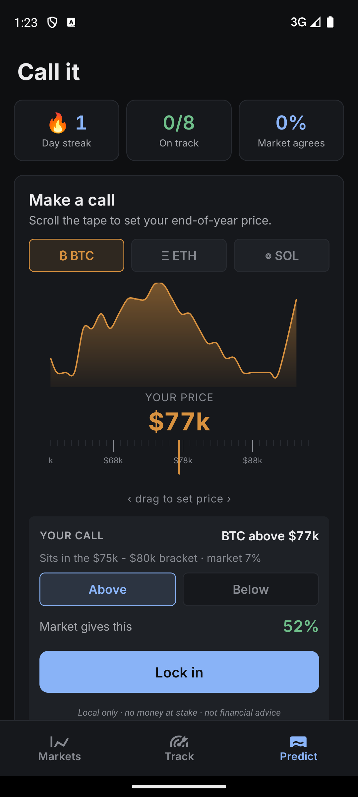
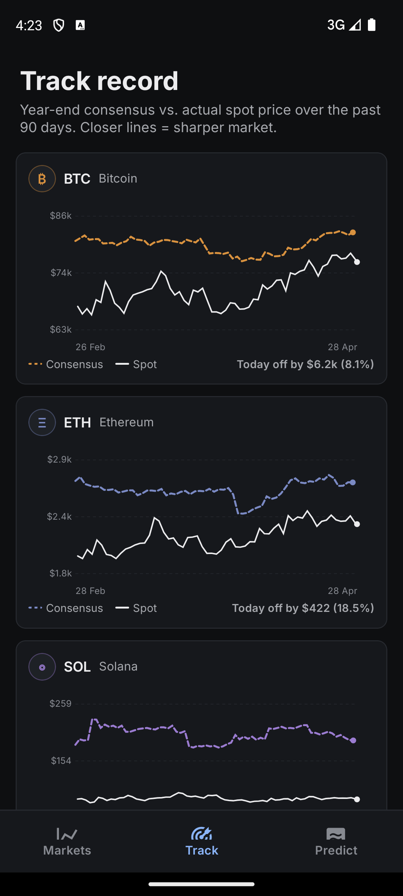
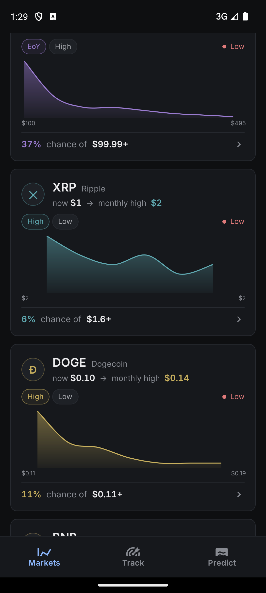

# Crowd Price

> Read consensus, predict, score your calls.

A Solana Mobile app that turns live Kalshi prediction-market trades into a probability lens on six cryptos — BTC, ETH, SOL, XRP, DOGE, BNB. See what the market expects each price to be by year-end, lock in your own "above $X" call, and watch how the consensus drifts vs. actual spot over 90 days.

**Live website**: https://crypto-forecasts.vercel.app/
**Solana dApp Store**: submitted, in review

---

## Screenshots

<table>
  <tr>
    <td></td>
    <td></td>
    <td></td>
    <td></td>
  </tr>
</table>

---

## What it does

- **Markets** — live probability distributions for six cryptos, refreshed every minute. Year-end consensus expected value plus a smooth probability curve per coin.
- **Predict** — drag an iOS-style price-tape to set a target, lock in an above/below call, get scored against the live consensus when the year resolves.
- **Track** — 90-day chart of how the year-end consensus has moved vs. actual CoinGecko spot. Closer lines = sharper market.

The forecast is **not** generated by us. We summarize what real-money traders are paying for outcomes on Kalshi prediction markets — the app turns each market's bid prices into an implied probability per bracket and a single probability-weighted expected value per coin.

---

## Tech stack

- React Native 0.76 + Expo SDK 52, TypeScript 5
- Solana Mobile Wallet Adapter 2.2 (identity-only — never signs value-bearing transactions)
- @solana/web3.js, @solana/spl-token
- TanStack Query 5, React Native Paper, react-native-svg
- AsyncStorage for local-only persistence
- expo-notifications for local push (no backend, no FCM tokens registered remotely)
- Inter via @expo-google-fonts/inter

---

## Data sources

- **Kalshi** (`api.elections.kalshi.com`) — prediction-market trades and order book
- **CoinGecko** (`api.coingecko.com`) — spot prices

No backend, no analytics SDKs, no third-party data brokers. Outbound traffic is exclusively to those two public APIs.

---

## Build locally

```bash
npm install

# Run on a connected Android device / emulator (debug, requires Metro)
npm run android

# Build a release APK locally (requires a keystore configured in ~/.gradle/gradle.properties)
cd android && ./gradlew assembleRelease
# → app-release.apk in android/app/build/outputs/apk/release/
```

Tests: `npm test` — 156 unit tests covering streak math, accuracy scoring, market analytics, Kalshi parsing, prediction drift detection.

---

## Project structure

```
src/
  components/    SymbolCard, DistributionCurve, PriceTape, TrackRecordChart, NewPredictionForm, ...
  screens/       DashboardScreen, AccuracyTrackerScreen, PredictionGameScreen, CryptoDetailScreen, OnboardingScreen, SettingsScreen
  services/      kalshiApi, kalshiParser, coinGeckoApi, forecastHistory, storageService, notificationService
  hooks/         useForecast, useSpotPrices, usePredictions, useDigest, useAlertMonitor, ...
  utils/         streak, accuracyAnalytics, marketAnalytics, predictionScoring, digestAnalytics
  theme/         tokens (colors / spacing / radii / typography), paper theme, semantic helpers
  constants/     kalshi (series tickers), tokens (per-coin metadata + glyphs)
```

---

## Repository layout

- **`app` branch** — this branch, the mobile app source (React Native + Expo)
- **`main` branch** — the landing page deployed at https://crypto-forecasts.vercel.app/

---

## Disclaimer

Informational only. **Not financial advice.** Crowd Price summarizes prediction-market consensus from Kalshi — it does not generate forecasts. Markets are wrong sometimes; the consensus does not guarantee future prices. The app does not custody funds, execute trades, or process payments.

Privacy: https://crypto-forecasts.vercel.app/privacy
Terms: https://crypto-forecasts.vercel.app/terms

---

## Author

Andrei Kunitski — [kunandreww@gmail.com](mailto:kunandreww@gmail.com)
