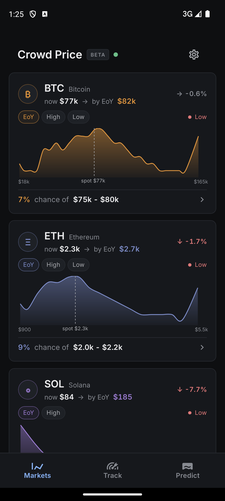
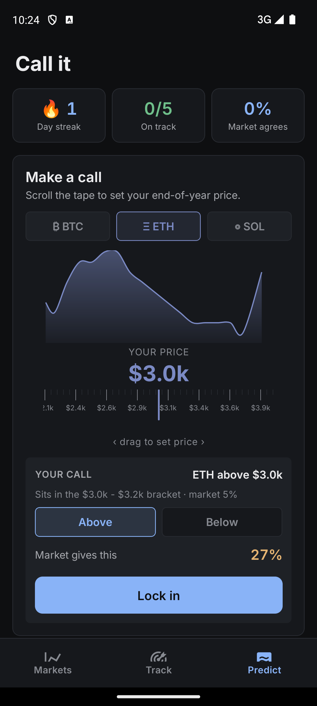
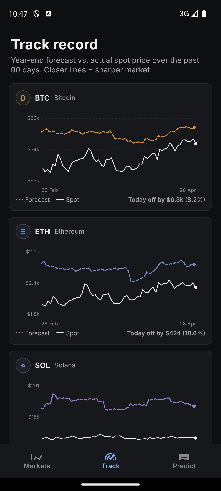
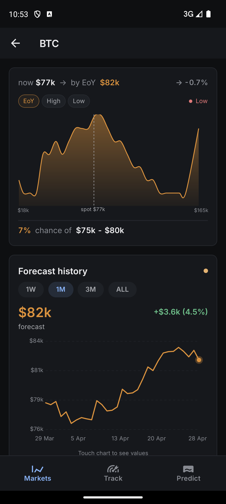

# Crowd Price

> Read consensus, predict, score your calls.

A Solana Mobile app that turns live Kalshi prediction-market trades into a probability lens on six cryptos — BTC, ETH, SOL, XRP, DOGE, BNB.

**Live website**: https://crypto-forecasts.vercel.app/
**Solana dApp Store**: https://seekertracker.com/apps?app=com.cryptoforecasts.app

---

## Looking for the mobile app source code?

The Android app source lives on the **[`app` branch](https://github.com/andreferd/Crypto-Forecasts/tree/app)** of this repository.

This `main` branch contains only the public marketing site (landing page + privacy / terms / copyright / contact pages) deployed at https://crypto-forecasts.vercel.app/.

| Branch | Contents | Stack |
|---|---|---|
| [`app`](https://github.com/andreferd/Crypto-Forecasts/tree/app) | Mobile app (Crowd Price) | React Native 0.76 · Expo SDK 52 · TypeScript · Solana Mobile Wallet Adapter |
| `main` | Landing page + legal pages | Static HTML · Tailwind CDN |

Hackathon judges and reviewers — please open the [`app` branch](https://github.com/andreferd/Crypto-Forecasts/tree/app) for the project README, screenshots, build instructions, and the actual code.

---

## Live screenshots

<table>
  <tr>
    <td></td>
    <td></td>
    <td></td>
    <td></td>
  </tr>
</table>

---

## Pages

- [Landing page](https://crypto-forecasts.vercel.app/) — `index.html`
- [Privacy](https://crypto-forecasts.vercel.app/privacy) — `privacy.html`
- [Terms of Use](https://crypto-forecasts.vercel.app/terms) — `terms.html`
- [Copyright](https://crypto-forecasts.vercel.app/copyright) — `copyright.html`
- [Contact](https://crypto-forecasts.vercel.app/contact) — `contact.html`

## Author

Andrei Kunitski — [kunandreww@gmail.com](mailto:kunandreww@gmail.com)
